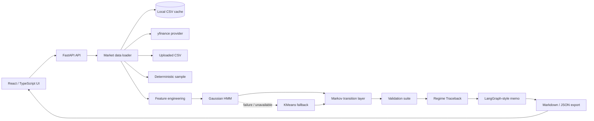
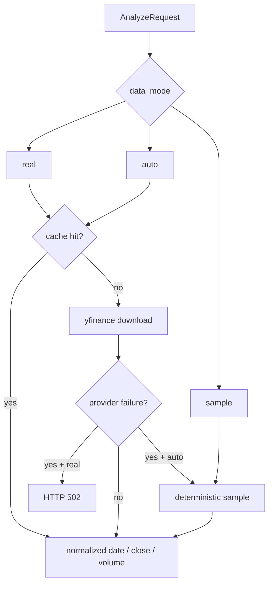
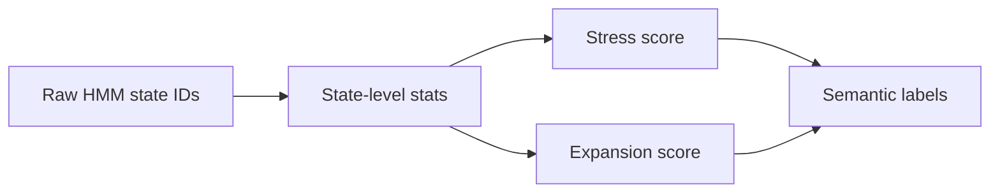
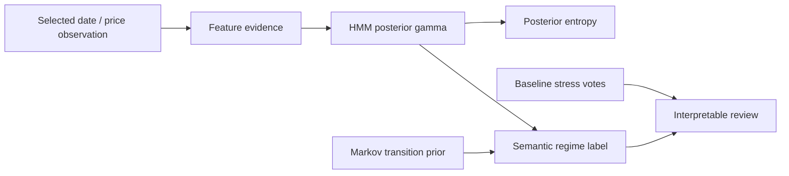
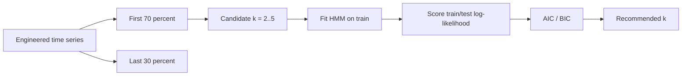

# QuantRegimeTracer

QuantRegimeTracer is a full-stack workbench for **auditable market-regime inference**. It ingests real market data by default, engineers time-series risk features, infers latent regimes with a Gaussian Hidden Markov Model, estimates empirical Markov transitions, benchmarks the inferred stress regime against transparent baselines, and exposes a point-level **Regime Traceback** layer that reconstructs the evidence path behind each regime label.

The system is deliberately framed as **model diagnostics and risk review**, not as a trading bot, portfolio optimizer, or financial-advice engine.

---

## 1. Core objective

Market time series are noisy and non-stationary. A raw price chart rarely answers the operational questions that matter during review:

- Which regime does the latest observation resemble?
- How persistent has this regime been historically?
- How likely is a transition into a stress-like state under the fitted transition matrix?
- Is the model output consistent with simpler volatility and drawdown baselines?
- Is the chosen number of regimes supported by BIC / held-out likelihood diagnostics?
- Are HMM assignments stable across random initializations?
- Was the analysis run on real market data, cached provider data, uploaded CSV data, or offline sample data?
- For any selected date, which features, posterior probabilities, transition priors and baselines explain the assigned regime?

QuantRegimeTracer answers those questions through an end-to-end backend + frontend system rather than a notebook.

---

## 2. Current data policy

QuantRegimeTracer is now **real-market-data first**.

| Mode | Behavior | Sample fallback | Intended use |
|---|---|---:|---|
| `real` | Requires local cache or yfinance market data | No | Normal operation and real validation |
| `auto` | Tries cache/yfinance first, then deterministic sample | Yes, explicit warning | Offline continuity or degraded local runs |
| `sample` | Uses deterministic synthetic regime-switching data | N/A | Unit tests, reproducible development, offline examples |
| `uploaded_csv` | User-supplied `date, close, volume?` CSV | N/A | Custom datasets |

The API response includes a `source_report` object:

```json
{
  "mode": "real",
  "source": "yfinance",
  "is_real_data": true,
  "provider": "yfinance",
  "cache_hit": false,
  "requested_start": "2021-07-08",
  "requested_end": "2026-07-08",
  "actual_start": "2021-07-08",
  "actual_end": "2026-07-07",
  "observations": 1257,
  "policy": "real data required"
}
```

A run should not be treated as real-market backed unless:

```text
source_report.is_real_data == true
source in {"yfinance", "cache:yfinance"}
```

---

## 3. System architecture



Backend responsibilities:

- data source resolution and caching
- feature engineering
- HMM fitting and posterior extraction
- post-fit semantic labeling
- Markov transition estimation
- baseline-suite comparison
- temporal HMM model selection
- multi-seed stability review
- source-report and data-quality reporting
- guarded memo/report generation

Frontend responsibilities:

- data-mode selection: `real`, `auto`, `sample`
- asset/window/regime-count controls
- price + inferred regime chart
- posterior state mass and entropy chart
- regime summary metrics
- validation diagnostics
- Regime Traceback for point-level evidence inspection
- cross-asset comparison
- Markdown/JSON export

---

## 4. Data ingestion pipeline



The loader normalizes every accepted dataset into:

```text
date:   datetime64
close:  float
volume: float | NaN
```

CSV uploads must include at least:

```csv
date,close
2024-01-02,472.65
...
```

`volume` is optional. At least 180 valid observations are required.

---

## 5. Feature engineering

Input prices are transformed into a compact feature vector designed for unsupervised regime inference.

| Feature | Purpose |
|---|---|
| `log_return` | one-period log return |
| `rolling_volatility` | annualized rolling volatility proxy |
| `rolling_mean_return` | short-term drift proxy |
| `drawdown` | current drawdown from running high |
| `ma_distance` | distance from moving average |
| `momentum_20` | 20-period momentum |
| `rsi` | bounded trend / exhaustion feature |
| `volume_change` | optional volume shock feature when volume is available |

Simplified formulas:

```text
r_t = log(P_t / P_{t-1})
vol_t = std(r_{t-w:t}) * sqrt(252)
drawdown_t = P_t / max(P_0 ... P_t) - 1
momentum20_t = P_t / P_{t-20} - 1
ma_distance_t = P_t / MA_w(P)_t - 1
```

The feature matrix is standardized before fitting the HMM.

---

## 6. Regime model

Primary model:

```text
hmmlearn.hmm.GaussianHMM(
    n_components = k,
    covariance_type = "full",
    n_iter = 500,
    random_state = 42
)
```

Outputs:

- inferred state path `z_t`
- posterior probability vector `γ_t = P(z_t | x_1:T)`
- current-state assignment strength `max_i γ_t(i)`
- posterior entropy `H(γ_t)`
- state-level summary statistics
- empirical transition matrix

Fallback model:

```text
KMeans(n_clusters=k, random_state=42, n_init=10)
```

Fallback is intentionally explicit. If KMeans is used, the diagnostics identify the assignment style as a hard-cluster proxy rather than a smoothed HMM posterior.

---

## 7. Semantic labeling and label switching

HMM states are not intrinsically ordered. State `0` is not guaranteed to mean the same thing across assets or fits.

QuantRegimeTracer therefore labels states post-fit using state-level statistics:

- stress score: high volatility + negative return + deep drawdown
- expansion score: positive return + positive momentum + lower volatility
- remaining states: sideways / transition

This avoids hard-coding state IDs and handles label switching more honestly.



---

## 8. Markov transition layer

After inference, QuantRegimeTracer estimates an empirical transition matrix over the state path:

```text
P_ij = count(z_t = i, z_{t+1} = j) / count(z_t = i)
```

Derived quantities:

```text
stay probability       = P_ii
expected persistence   = 1 / (1 - P_ii)
transition entropy     = -Σ_j P_ij log(P_ij) / log(k)
stress transition prob = P_i,stress
```

These are historical estimates over the inferred state sequence, not forward guarantees.

---

## 9. Regime Traceback layer

The core differentiator is not that the system labels regimes. Many tools do that.

QuantRegimeTracer is designed to make a regime label **auditable**. For any sampled date in the inferred state path, the backend reconstructs the route from market observation to interpretation:



For each traceback point, the API returns:

| Field | Meaning |
|---|---|
| `assigned_state` | inferred state ID for the selected observation |
| `semantic_label` | post-fit label such as stress, expansion or transition |
| `posterior_confidence` | backwards-compatible field for MAP posterior state mass, `γ_t(z_t)` |
| `assignment_type` | readable classification of the posterior shape: near one-hot, strong assignment, probabilistic split or ambiguous posterior |
| `evidence_strength` | composite traceability score combining posterior sharpness, baseline agreement and feature evidence |
| `posterior_entropy` | normalized uncertainty, `H(γ_t)` |
| `transition_prior` | empirical Markov probability of moving from previous state into the assigned state |
| `feature_evidence` | volatility, drawdown, momentum, RSI and return evidence with within-window percentiles |
| `baseline_votes` | rolling-volatility, EWMA-volatility and drawdown baseline votes |
| `baseline_agreement_share` | how many transparent baselines agree with the HMM stress/non-stress interpretation |
| `interpretation` | compact human-readable explanation of the assignment |

This turns the project from a regime-classification dashboard into an **auditable inference workflow**:

```text
market data
→ engineered features
→ HMM posterior state mass
→ assignment type and posterior entropy
→ evidence strength
→ Markov transition prior
→ baseline agreement
→ semantic label
→ review memo
```

The traceback layer is intentionally not a price-prediction explanation. It explains the model's **regime assignment**, uncertainty, evidence strength and validation context.

---

## 10. Model validation layer

QuantRegimeTracer includes several checks designed to make the system harder to overclaim.

### 10.1 Baseline suite

The HMM stress state is compared against transparent baselines:

1. rolling-volatility quantile baseline
2. EWMA-volatility stress baseline
3. drawdown stress baseline

The output includes:

- stress agreement
- disagreement rate
- disagreement segments
- suite mean agreement
- suite verdict: `aligned`, `mixed`, `divergent`

### 10.2 Temporal HMM holdout

Candidate regime counts are evaluated on a chronological train/test split.



Reported diagnostics:

- train log-likelihood per observation
- test log-likelihood per observation
- train/test likelihood gap
- AIC
- BIC
- BIC-first recommended number of regimes
- whether selected `k` matches the recommendation

### 10.3 Multi-seed stability

HMMs can converge to different local optima. QuantRegimeTracer refits the selected model with multiple random seeds and compares assignments using Adjusted Rand Index.

```text
ARI = 1.0     identical clustering up to label permutation
ARI ≈ 0.0     random-like agreement
ARI < 0.0     worse than random under adjustment
```

Reported diagnostics:

- mean pairwise ARI
- minimum pairwise ARI
- number of successful fits
- verdict: stable / moderate / unstable / unavailable

### 10.4 Data quality report

The API reports:

- source
- cache hit
- observation count
- date span
- largest date gap
- duplicate dates
- missing close values
- missing volume values
- source-specific notes

---

## 11. API surface

### Health and metadata

| Method | Endpoint | Description |
|---|---|---|
| `GET` | `/health` | service status and API version |
| `GET` | `/assets` | supported ticker list |
| `GET` | `/time-windows` | supported window presets |
| `GET` | `/data-sources` | data-mode policy and provider info |
| `GET` | `/model-card` | model assumptions, outputs and guardrails |
| `GET` | `/case-study` | architecture and methodology summary |
| `GET` | `/sample-csv` | deterministic CSV sample for upload testing |

### Analyze one asset

```bash
curl -X POST http://localhost:8000/analyze \
  -H "Content-Type: application/json" \
  -d '{
    "asset": "SPY",
    "interval": "5Y",
    "n_regimes": 3,
    "data_mode": "real",
    "language": "en"
  }'
```

Important request fields:

| Field | Type | Default | Meaning |
|---|---:|---:|---|
| `asset` | string | `SPY` | ticker symbol |
| `interval` | string | `5Y` | `6M`, `1Y`, `3Y`, `5Y`, `MAX` |
| `start` / `end` | date | null | explicit override |
| `n_regimes` | int | `3` | HMM state count, 2 to 5 |
| `data_mode` | string | `real` | `real`, `auto`, `sample` |
| `force_refresh` | bool | false | bypass cache and request provider data |
| `language` | string | `en` | `en` or `es` |

### Compare several assets

```bash
curl -X POST http://localhost:8000/compare \
  -H "Content-Type: application/json" \
  -d '{
    "assets": ["SPY", "QQQ", "BTC-USD", "GLD", "TLT"],
    "interval": "3Y",
    "n_regimes": 3,
    "data_mode": "real"
  }'
```

### Upload CSV

```bash
curl -X POST "http://localhost:8000/upload-csv?n_regimes=3&language=en" \
  -F "file=@my_prices.csv"
```

---

## 12. Running locally

### Backend

```bash
cd backend
python -m venv .venv
source .venv/bin/activate      # macOS / Linux
# .\.venv\Scripts\activate    # Windows PowerShell
pip install -r requirements.txt
uvicorn app.main:app --reload --port 8000
```

### Frontend

```bash
cd frontend
npm ci
npm run doctor
npm run dev
```

Open:

```text
http://localhost:5173
```

The frontend defaults to `real` data mode. If the provider is unavailable, switch to `auto` for explicit sample fallback or `sample` for offline reproducibility.

---

## 13. Real-data validation harness

Run a batch validation report:

```bash
python backend/scripts/real_data_validation.py \
  --assets SPY QQQ BTC-USD GLD TLT \
  --interval 5Y \
  --regimes 3 \
  --data-mode real
```

Outputs:

```text
reports/real_data_validation.json
reports/real_data_validation.md
```

Use explicit fallback only when needed:

```bash
python backend/scripts/real_data_validation.py \
  --assets SPY QQQ BTC-USD GLD TLT \
  --interval 5Y \
  --regimes 3 \
  --data-mode auto
```

The report includes `is_real_data`. Treat a row as real-data backed only when that field is `true`.

### 13.1 Real-data validation findings

A real-data validation run was executed on SPY, QQQ, BTC-USD, GLD and TLT using `data_mode=real` and yfinance-backed market data.

The run confirmed that all five assets were analyzed with real data, `GaussianHMM` inference, baseline-suite comparison, chronological train/test diagnostics, multi-seed stability checks and data-quality reporting.

See:

```text
reports/REAL_DATA_VALIDATION.md
reports/real_data_validation.json
```

Key findings from the generated validation bundle:

1. **Regime-count mismatch**  
   The interactive UI defaults to `k=3` regimes for interpretability: expansion-like, transition-like and stress-like states. The validation layer recommended `k=5` by BIC across all five evaluated assets. This mismatch is intentionally surfaced as a review flag rather than hidden; it suggests that the data may support a finer regime decomposition than the default interpretability setting.

2. **GLD overfit-risk case**  
   GLD produced an `overfit_risk` verdict in temporal holdout diagnostics. The model still produced a latent-state assignment, but the large train/test log-likelihood gap means the fitted HMM generalized poorly to the held-out period. QuantRegimeTracer keeps the regime label inspectable while attaching the warning that the model should not be treated as robust on that asset/window without further review.

3. **QQQ moderate stability**  
   QQQ showed only moderate multi-seed assignment stability. This means different HMM initializations can produce meaningfully different latent partitions, so the QQQ regime path should be interpreted more cautiously than assets whose assignments are stable across seeds.

4. **Near one-hot state mass is not forecast certainty**  
   Some latest observations have posterior state mass near 1.0. This is reported as assignment strength under the fitted HMM, not as directional market certainty. The product therefore separates state assignment strength, posterior entropy, evidence strength, baseline agreement and temporal generalization.

These findings are part of the intended design. QuantRegimeTracer is not built to always return a clean answer. It is built to expose when the model output is stable, when it is uncertain, and when validation diagnostics disagree.

---

## 14. Tests and gates

Backend tests:

```bash
cd backend
pytest -q
python scripts/smoke_test.py
```

Frontend gates:

```bash
cd frontend
npm ci
npm run doctor
npm run typecheck
npm run smoke
npm run build
npm audit --omit=dev
```

The test suite uses `data_mode='sample'` where deterministic offline behavior is required. This keeps tests reproducible while the application default remains real-data-first.

For a stricter model/product validation checklist, see [`docs/VALIDATION_PROTOCOL.md`](docs/VALIDATION_PROTOCOL.md).

---

## 15. Repository structure

```text
QuantRegimeTracer/
├── backend/
│   ├── app/
│   │   ├── main.py
│   │   ├── models/schemas.py
│   │   ├── services/
│   │   │   ├── data_loader.py
│   │   │   ├── features.py
│   │   │   ├── regime_model.py
│   │   │   ├── model_evaluation.py
│   │   │   ├── risk_metrics.py
│   │   │   ├── traceback.py
│   │   │   └── validation.py
│   │   └── graphs/memo_graph.py
│   ├── scripts/
│   │   ├── smoke_test.py
│   │   └── real_data_validation.py
│   └── tests/
├── frontend/
│   ├── src/App.tsx
│   ├── src/components/
│   │   └── RegimeTracebackPanel.tsx
│   └── src/lib/
├── docs/
├── reports/
└── README.md
```

---

## 16. Known limitations

- yfinance availability is external and can fail, throttle, or change fields.

- The current UI default of `k=3` is an interpretability choice; the real-data validation bundle may recommend a finer state count such as `k=5` by BIC.
- A clean-looking regime path can still fail temporal validation; GLD in the committed validation bundle is an explicit overfit-risk example.
- Moderate multi-seed stability, such as the QQQ validation case, means latent partitions should be interpreted cautiously even when posterior state mass is sharp.
- HMM regimes are inferred latent states, not ground-truth labels.
- BIC and held-out likelihood evaluate statistical fit, not trading performance.
- Markov transition estimates assume the fitted state path is meaningful and sufficiently stable.
- Baseline agreement is a diagnostic sanity check, not proof that a regime is economically actionable.
- No transaction costs, slippage, execution model, or PnL backtest is included.
- Multi-seed stability can flag unstable assignments, but it does not solve non-stationarity.
- Regime Traceback explains model assignments; it does not prove causal market mechanisms.

---

## 17. Next technical upgrades

High-value next steps:

1. Persist validated real-data reports per asset and commit only summary artifacts.
2. Add provider abstraction for alternatives to yfinance.
3. Add walk-forward refit evaluation over multiple chronological folds.
4. Add covariance-type comparison: diagonal vs full HMM covariance.
5. Add likelihood-ratio or bootstrap diagnostics for regime-count sensitivity.
6. Add frontend component tests for data-mode controls and validation panels.
7. Add optional GARCH or Markov-switching AR baseline for a stronger econometric comparison.

---

## 18. Guardrail

QuantRegimeTracer is not investment research, financial advice, or a trading recommendation system. It is a technical system for regime diagnostics, uncertainty exposure, cross-asset risk review and model-evaluation practice.
